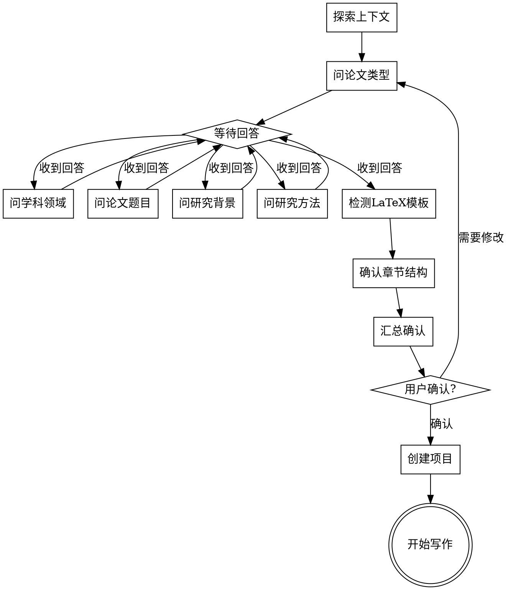

# 科研写作头脑风暴

通过自然的协作对话，帮助用户将论文想法转化为完整的写作计划。

**核心原则：一次只问一个问题，等待用户回答后再继续下一个。**

**交互原则：让用户少做选择，多做确认。提供推荐方案，让用户确认或微调。**

<EXTREMELY-IMPORTANT>
## 交互方式约束

你必须以**对话方式**进行头脑风暴，而不是列出表单让用户填写：

**正确做法**：
- 每次只问一个问题
- 用自然语言提问，像同事间的讨论
- 等待用户回答后，确认理解，再问下一个问题
- **提供推荐方案，让用户确认**，而不是让用户从零开始选择
- 给出你的建议和理由，帮助用户做选择

**错误做法**：
- 一次性列出所有问题
- 把问题编号像表单一样展示
- 不等用户回答就继续
- 干巴巴地列选项不给建议
- 让用户从空白开始填写

**示例对比**：

❌ 错误："请选择：1.本科 2.硕士 3.博士 4.期刊 5.会议 6.课程"

✅ 正确："你这次要写的是什么类型的论文？是毕业论文、期刊投稿，还是课程作业？如果是毕业论文，是本科、硕士还是博士阶段的？"
</EXTREMELY-IMPORTANT>

<HARD-GATE>
在完成所有问答并获得用户最终确认之前，禁止：
- 写任何正文内容
- 创建 chapters/ 目录
- 调用 writing-chapters 技能
- 输出任何论文章节的实际内容

无论用户的任务看起来多么"简单"，都必须经过此流程。
</HARD-GATE>

## 语言默认规则

| 论文类型 | 默认语言 | 说明 |
|----------|----------|------|
| 本科毕业论文 | 中文 | 除非用户明确要求英文 |
| 硕士毕业论文 | 中文 | 除非用户明确要求英文 |
| 博士毕业论文 | 中文 | 除非用户明确要求英文 |
| 中文核心期刊 | 中文 | |
| SCI/SSCI期刊 | 英文 | 根据期刊要求 |
| 会议论文 | 英文 | 国际会议为主 |
| 课程论文 | 中文 | 除非课程要求英文 |

**不需要主动询问语言**，根据论文类型自动确定。只有当用户有特殊语言需求时才调整。

## 已有论文信息提示

在开始问答前，检查用户是否已有论文相关信息：

> "在开始之前，如果你已经有论文的相关材料（比如题目、摘要、导师要求的结构），可以现在发给我，我会根据这些信息来规划。如果没有也没关系，我们从头开始讨论。"

**等待用户回复**，如果提供了材料，快速浏览并提取关键信息，然后在后续问答中确认。

## 反模式："这太简单了不需要讨论"

每个论文项目都要经过这个流程。一篇课程论文、一个简单修改、一段摘要 — 都需要。"简单"的项目往往因为未经检验的假设导致最多的返工。讨论可以很简短，但必须呈现信息并获得确认。

## Checklist

按顺序完成：

1. **探索项目上下文** — 检查是否已有 plan/、现有文件、用户提供的信息
2. **确认论文类型** — 对话式提问，等待回答
3. **确认学科领域** — 对话式提问，等待回答
4. **确认论文题目** — 对话式提问，等待回答
5. **确认研究背景与目的** — 对话式提问，等待回答
6. **确认研究方法** — 对话式提问，等待回答
7. **检测 LaTeX 模板** — 如果存在，询问是否使用
8. **确认章节结构** — **根据论文类型提供标准结构，让用户确认**
9. **汇总确认** — 展示所有信息，获得最终确认
10. **创建项目结构** — 创建 plan/、chapters/、refs/、最终参考文献章和引用校验 CSV
11. **转到章节写作** — 询问从哪章开始

## 流程图



---

## 对话指南

### 第一个问题：论文类型

用自然语言询问，给出你的观察和建议：

> "你这次要写的是什么类型的论文？
>
> 比如：
> - 毕业论文（本科/硕士/博士）
> - 期刊投稿（中文核心 / SCI）
> - 会议论文
> - 课程论文或报告
>
> 不同类型的论文在篇幅、结构和语言风格上会有差异，我需要先了解这个来帮你规划。"

**等待用户回答。** 收到回答后，确认你的理解：
> "好的，[论文类型]。这类论文通常使用 [引用格式]，写作风格偏向 [风格特点]。"

然后进入下一个问题。

### 第二个问题：学科领域

> "你的研究属于哪个学科领域？
>
> 这会影响我给你的写作建议和章节安排。比如工科论文侧重技术方案和实验验证，社科论文更强调理论框架和数据分析，医学论文有特殊的报告规范要求。"

**等待用户回答。**

### 第三个问题：论文题目

> "论文题目定了吗？可以是暂定的，我们后面还可以调整。
>
> 如果还在犹豫，可以告诉我你想研究的大方向，我帮你一起想想怎么聚焦。"

**等待用户回答。**

### 第四个问题：研究背景与目的

根据用户的学科和题目，用更具体的方式提问：

> "关于你的研究，我想了解一下：
>
> 你为什么选择这个题目？是发现了什么问题想解决，还是想验证某个想法？
>
> 简单说说背景就好，不用太正式。"

**等待用户回答。** 如果回答不够清晰，可以追问：
> "明白了。那你希望通过这个研究达成什么目标？解决什么具体问题？"

### 第五个问题：研究方法

根据学科领域，问题侧重点不同：

**工科**：
> "你打算用什么技术方案或方法？有没有要做的实验或系统？性能怎么评估？"

**社科**：
> "你的研究方法是什么？问卷调查、访谈、案例分析，还是其他？数据怎么收集和分析？"

**医学**：
> "这是临床研究还是基础研究？样本量大概多少？伦理审批这块有没有考虑？"

**文科**：
> "你打算从什么理论视角切入？研究的文本或材料来源是什么？"

**法学**：
> "你要分析的法律问题是什么？会用到案例分析还是比较法研究？"

**等待用户回答。**

### LaTeX 模板检测

检查 `latex-templates/` 目录：

**如果存在模板文件**：
> "我注意到你放了 LaTeX 模板文件。你想用这个模板来输出论文吗？
>
> 用模板的话，我会直接生成 .tex 文件，可以用 LaTeX 编译成 PDF。
> 不用的话，我会输出 Markdown 文件，你可以后续复制到 Word。
>
> 你想怎么处理？"

**如果不存在模板**：默认使用 Markdown，不需要询问。

### 第六个问题：章节结构

根据用户确认的论文类型，**自动推荐**对应的章节结构：

> "根据你的 [论文类型]，我建议这样的章节结构：
>
> [展示对应类型的结构，>
> [从 templates.md 读取]
>
> 这是 [论文类型] 的标准结构。你可以：
> 1. **直接确认** — 使用这个结构
> 2. **微调** — 告诉我需要增删或调整的章节
>
> 你想怎么处理？"

**重要**：优先让用户确认, 而不是让用户设计。如果用户没有特殊要求, 使用默认结构即可.

### 汇总确认

收集完所有信息后，呈现汇总：

> "好，我整理一下我们讨论的内容：
>
> - **论文类型**：[类型]
> - **学科领域**：[领域]
> - **论文题目**：[题目]
> - **研究背景**：[简述]
> - **研究目的**：[简述]
> - **研究方法**：[简述]
> - **输出格式**：[Markdown / LaTeX]
> - **章节结构**：
>   - [章节列表]
>
> 这些信息都对吗？确认后我会创建项目结构，然后我们就可以开始写了。"

<HARD-GATE>
必须等待用户明确确认（如"对"、"可以"、"确认"、"没问题"）后才能继续。
不得假设用户同意。
</HARD-GATE>

---

## 创建项目结构

用户确认后，执行以下操作：

1. **创建 plan/ 目录**（如不存在）
2. **填充 project-overview.md**：

```markdown
# 项目概览

## 基本信息

- **论文类型**：[类型]
- **学科领域**：[领域]
- **论文题目**：[题目]
- **创建时间**：[日期]
- **输出格式**：[Markdown / LaTeX]
- **当前阶段**：头脑风暴完成，待开始写作

## 研究信息

### 研究背景
[用户描述]

### 研究目的
[用户描述]

### 研究方法
[用户描述]

## 章节结构

[章节列表]

## 写作规范

- **语言**：[中文/英文]
- **引用格式**：[格式]
- **写作模块**：[对应模块]
```

3. **填充 outline.md**：详细章节大纲
4. **更新 progress.md**：记录头脑风暴完成
5. **创建 chapters/ 目录**：创建空的章节文件，并把参考文献、尾注或资料来源作为最后一个独立章节文件（默认命名如 `chapters/07-references.md`，章节号按实际大纲调整）
6. **创建 refs/ 目录**：
   - 创建 `refs/citation-verification.csv`
   - 创建 `refs/README.md`
   - 如已有旧项目使用 `refs/reference-verification.csv`，可保留兼容，但新项目默认使用 `refs/citation-verification.csv`

`refs/citation-verification.csv` 必须使用 UTF-8，表头如下：

```csv
引用编号,引用来源,论文引用位置,是否人工校验,校验状态,校验情况,用户校验结果,处理建议,最后更新
```

`refs/README.md` 必须写明：

- 每新增、删除或修改一条正文引用，都同步更新最终参考文献章和 `refs/citation-verification.csv`。
- 机器检索、DOI、数据库、网页或本地 PDF 核验只属于机器初核，不等于人工校验。
- 只有用户明确确认后，才能填写人工校验状态。
- 用户确认虚构、不可用或不匹配的引用，必须从正文、最终参考文献章和校验表中删除或替换，并告知用户。

## 转到写作

> "项目结构已经创建好了。
>
> 你想从哪一章开始写？
>
> 我的建议是先写绪论，把研究问题和目标明确下来，这样后面的章节写起来会更顺。不过如果你对文献综述或方法部分更有把握，也可以先从那里开始。
>
> 你想先写哪部分？"

**等待用户回答**，然后调用 `writing-chapters` 技能。

---

## 关键原则

- **一次只问一个问题** — 不要用多个问题压倒用户
- **等待回答再继续** — 不要假设用户的选择
- **对话式而非表单式** — 像同事讨论，不是填问卷
- **给出建议和理由** — 帮助用户做选择，不是干巴巴列选项
- **灵活调整** — 如果用户想跳过某些讨论，可以简化但不能跳过最终确认
- **记录一切** — 所有决策都写入 plan/
