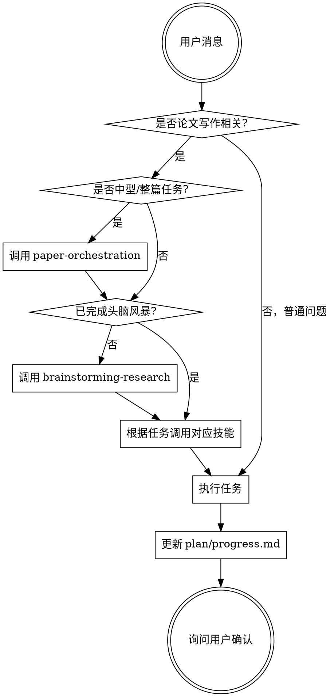

<SUBAGENT-STOP>
如果你是作为子代理被派发执行特定任务，跳过此技能。
</SUBAGENT-STOP>

<EXTREMELY-IMPORTANT>
当用户提出任何与论文写作相关的任务时，你必须调用相应的技能。

如果你认为有哪怕 1% 的可能性某个技能适用于当前任务，你必须调用该技能。

这不是建议，是强制要求。不允许跳过流程直接写作。不允许找任何借口。
</EXTREMELY-IMPORTANT>

## 指令优先级

科研写作技能会覆盖默认系统提示行为，但**用户指令始终优先**：

1. **用户明确指令**（直接请求、CLAUDE.md、AGENTS.md 中的设置）— 最高优先级
2. **科研写作技能** — 覆盖默认系统行为
3. **默认系统提示** — 最低优先级

如果用户说"不需要讨论直接写"，你可以简化流程，但仍需记录到 plan/。

## 如何访问技能

**在 Claude Code 中：** 使用 `Skill` 工具。调用技能时，其内容会被加载并呈现给你 — 直接遵循即可。

**在 Cursor 中：** 技能通过会话启动 hook 自动加载。使用 `Skill` 工具调用其他技能。

**在 Codex 中：** 技能通过符号链接加载。参考 `.codex/INSTALL.md`。

**在 OpenCode 中：** 使用原生 `skill` 工具：`use skill tool to load research-writing/brainstorming-research`

## 核心规则

**在任何响应或行动之前，先调用相关技能。** 即使只有 1% 的可能性某个技能适用，你也应该调用它检查。

**中型或整篇论文任务必须先调用 `paper-orchestration`。** 中型任务包括：影响多个段落、一个以上小节、任一章节、文献论证链、实验/图表设计、或任何已出现质量失败的返工任务。`paper-orchestration` 负责阶段判断、任务包、子代理分发、两阶段 review 与 capability-use audit（能力使用审计）。

**引用基础设施必须默认建立。** 学位论文、课程论文、报告和章节型论文默认设置最终独立参考文献/注释章（如 `chapters/07-references.md`），并维护 `refs/citation-verification.csv`。每新增、删除或修改引用，都必须同步最终参考文献章和 CSV；机器初核不得写成用户人工校验。

## Red Flags（停止并检查）

这些想法意味着你在找借口 — 停下来：

| AI 的想法 | 正确做法 |
|-----------|----------|
| "用户说得很清楚了，直接开始写" | 必须先完成 brainstorming-research |
| "这只是修改一小段" | 检查是否有 plan/，没有则先创建 |
| "先写一段看看效果" | 必须先确认论文类型和章节结构 |
| "用户很着急，跳过讨论" | 流程可以加速，但不能跳过关键确认 |
| "这是简单任务，不需要 plan" | 任何写作任务都需要 plan 记录 |
| "我知道怎么写论文" | 必须按用户选择的类型和结构写 |
| "先把内容写完再说格式" | 格式在 brainstorming 阶段确定 |
| "这章内容很简单，不用确认" | 每章写完都必须让用户确认 |
| "文献我可以补充一些" | 绝不编造文献，必须可追溯 |
| "我记得这个技能的内容" | 技能会更新，必须重新读取当前版本 |

## 技能路由

| 任务类型 | 调用技能 |
|----------|----------|
| 中型任务 / 整篇论文 / 多章节协作 / 质量返工 | paper-orchestration |
| 开始新论文 / 确定选题 / 第一次对话 | brainstorming-research |
| 引言 / 相关工作 / 背景综述 / 文献驱动段落 | evidence-driven-writing + literature-review |
| 写某一章节 | writing-chapters |
| 文献综述 | literature-review |
| 实验设计 / 结果章节 / mock 数据 / 表格方案 | experiment-results-planning |
| 画图 / 数据可视化 | figures-python |
| 流程图 / 架构图 | figures-diagram |
| 自审 / 检查 / 投稿准备 | peer-review |
| 统计分析 | statistical-analysis |
| LaTeX 输出 / 模板使用 | latex-output |
| 环境配置 / 安装问题 | environment-setup |
| 翻译 / 润色 / 去AI化 | prompts-collection |

## 技能优先级

当多个技能可能适用时，按以下顺序：

1. **流程技能优先**（brainstorming-research）— 决定如何开始任务
2. **实现技能其次**（writing-chapters、literature-review 等）— 指导具体执行

"帮我写论文" → 先 paper-orchestration，再 brainstorming-research，再 writing-chapters
"写第三章" → 检查是否已完成 brainstorming，是则直接 writing-chapters

"优化整篇初稿" → 先 paper-orchestration，生成任务包和能力使用审计，再分派章节或图表任务

## 技能类型

**严格型**（brainstorming-research、writing-chapters）：必须严格遵循，不得跳过步骤。

**灵活型**（prompts-collection、figures-diagram）：可根据上下文调整。

技能本身会说明属于哪种类型。

## 用户指令

用户指令说的是"做什么"，不是"怎么做"。"写第一章"或"帮我润色"不代表跳过工作流。

## 任务收尾

中型及以上任务完成前必须写入 capability-use audit（能力使用审计），记录应使用的技能、实际使用的技能、已消费资料、未使用资料及原因、产物、验证命令和剩余风险。缺少审计时，不得声称任务完成。
