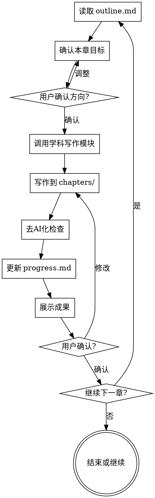

# 章节写作

负责论文各章节的实际写作。必须在头脑风暴完成、项目结构创建后调用。

<HARD-GATE>
调用此技能前必须满足以下条件：
1. plan/project-overview.md 存在且包含论文类型和章节结构
2. plan/outline.md 存在且已确认
3. chapters/ 目录已创建

如果任何条件不满足，必须先调用 brainstorming-research 技能。
</HARD-GATE>

<HARD-GATE>
章节写作必须先判断章节类型：

1. Introduction、Related Work、研究背景、文献综述：必须先调用 `evidence-driven-writing`，并读取 `refs/evidence-map.md` 或 `plan/evidence-map.md`。
2. Methodology、Methods、研究方法：必须按“输入到输出”的技术流写作，不能只罗列模块。
3. Results、Discussion、实验结果：必须先调用 `experiment-results-planning`，确认真实数据或明确标记的 mock/synthetic planning data。

任何用户要求都不得直接进入正文。诸如“写得自然”“不要泛泛而谈”“注意衔接”只能转化为句子、段落、结构和证据处理。
</HARD-GATE>

## Checklist（每章必须完成）

- [ ] 读取 plan/outline.md 确认本章目标和要点
- [ ] 如果存在 plan/chapter-architecture.md，确认本章文件名、最小正文长度和 agent owner
- [ ] 检查最终参考文献/注释章是否存在（默认 `chapters/XX-references.md`）以及 `refs/citation-verification.csv` 是否存在
- [ ] 写作前读取 `refs/citation-verification.csv`；若发现用户标记为虚构、不可用或不匹配的引用，停止使用并从正文和最终参考文献章中删除或替换
- [ ] 检查前置章节是否完成（按逻辑顺序）
- [ ] 与用户确认本章关键论点和内容方向
- [ ] 根据学科领域调用对应写作模块
- [ ] 对引言/相关工作读取 evidence-driven-writing 产物
- [ ] 对方法章节检查输入到输出 flow
- [ ] 执行正文污染 contamination firewall 检查
- [ ] 写作输出到 chapters/XX-name.md
- [ ] **阶段1：规范合规检查**
- [ ] **阶段2：质量检查（去AI化、语言流畅度）**
- [ ] 更新 plan/progress.md
- [ ] 展示写作成果，询问用户确认或修改
- [ ] 用户确认后，询问是否继续下一章

## Chapter Agent Contract

Full-paper drafts and redrafts must use a separate fresh agent for each major chapter. The controller prepares the task packet and review criteria; the chapter agent writes only its assigned file.

Each chapter agent must receive:

- the exact chapter file it owns;
- the chapter's role in the whole manuscript;
- required source files and evidence IDs;
- paragraph-level argument chain, not a list of section labels;
- minimum prose length from `plan/chapter-architecture.md`;
- prohibited wording and prohibited structure;
- instructions to report unresolved gaps instead of inventing evidence or results.

Each chapter agent must return:

- status: DONE, DONE_WITH_CONCERNS, NEEDS_CONTEXT, or BLOCKED;
- changed file path;
- short summary of argument chain;
- unresolved evidence/data gaps;
- self-review against the rejection checks.

The controller must record this in `plan/chapter-agent-provenance.md`. A chapter without provenance is not accepted for a full-paper redraft.

## 两阶段 Review 机制

每章写作完成后，必须执行两阶段检查：

### 阶段1：规范合规检查

检查是否满足论文基本要求：

| 检查项 | 说明 |
|--------|------|
| 字数 | 是否达到目标字数（±10%可接受）|
| 结构 | 章节结构是否完整，小节是否清晰 |
| 引用格式 | 引用格式是否统一（GB/T 7714 或 APA）|
| 标题层级 | 是否符合论文规范 |

**检查结果**：✅ 通过 / ❌ 需修改

### 阶段2：质量检查

检查写作质量：

| 检查项 | 说明 |
|--------|------|
| 去AI化 | 无机械过渡词、无空壳强调句 |
| 语言流畅 | 无重复表达、无冗余 |
| 学术表达 | 使用"本文"、"本研究"等客观表述 |
| 段落结构 | 优先连贯段落，不使用列表堆砌 |
| 引用真实 | 所有引用可追溯，无编造 |

**检查结果**：✅ 通过 / ❌ 需修改

## 写作流程



## 写作前准备

### 1. 读取项目信息

从 plan/ 读取：
- project-overview.md：论文类型、学科、研究背景
- outline.md：章节大纲和要点
- progress.md：已完成章节
- notes.md：用户偏好和特殊要求

**参考结构模板**: `skills/brainstorming-research/templates.md` 了解不同论文类型的标准结构。

### 2. 确认当前章节

> "根据大纲，本章「[章节名]」的主要内容是：
> - [要点1]
> - [要点2]
> - [要点3]
> 
> 请确认这些要点，或告诉我需要调整的内容："

### 3. 调用学科模块

| 学科领域 | 调用模块 |
|----------|----------|
| 工科、理科 | writing-core |
| 文科 | writing-humanities |
| 社科 | writing-humanities（侧重数据）|
| 医学 | writing-medical |
| 法学 | writing-law |

## 写作规范

<EXTREMELY-IMPORTANT>
以下规范必须严格遵守，不得因为"效率"或"简化"而跳过。
</EXTREMELY-IMPORTANT>

### 去 AI 化写作

1. **禁用机械过渡词**：首先、其次、最后、此外、另外、总之
2. **禁用空壳强调句**：值得注意的是、需要指出的是、重要的是、显而易见
3. **禁用主观化表达**：我认为、我觉得、我的研究（正文中）
4. **禁用列表堆砌**：论文正文优先连贯段落，不使用项目符号
5. **语气客观**：使用"本文"、"本研究"、"研究表明"等客观表述

### 反罗列写作

每章必须形成连续论证，而不是把要点平铺为短段落。正文段落应满足以下模式之一：

- 背景段：场景约束 → 研究矛盾 → 本章承接。
- 文献段：同类研究共同解决的问题 → 代表性证据 → 尚未覆盖的边界。
- 方法段：输入对象 → 处理过程 → 输出形式 → 设计理由。
- 实验段：评价目标 → 对照关系 → 指标含义 → 可接受结论边界。
- 讨论段：结果含义 → 工程/学术解释 → 局限和后续验证。

禁止把这些模式写成列表。每个正文段落都要包含因果、转折、承接或限定关系。除参考文献外，正文默认不得出现项目符号；贡献点需要列表时，最多 3 条，并且必须由前后段落解释。

### 长度和密度

对完整论文初稿，Introduction、Methodology、Experimental Results and Analysis、Discussion 等主体章节不能只写成摘要级说明。若 `plan/chapter-architecture.md` 给出 `min_chars`，必须达到该下限。达不到时，返回 NEEDS_CONTEXT 或继续扩写，不得把短稿标记为完成。

### 格式规范

1. **段落之间空一行**
2. **正文不使用加粗**（除术语首次定义）
3. **不使用斜体强调**
4. **标题层级清晰**

### 引用规范

1. **绝不编造文献**
2. **引用必须可追溯**：作者、年份、出处至少完整两项
3. **英文文献可检索后引用**
4. **中文文献优先走 CNKI MCP/浏览器检索链路**：可用时由 AI 批量检索、筛选、下载、读取和入库；不可用时再让用户提供来源
5. **参考文献独立成章**：除非用户、院校或期刊明确要求，不在每章末尾放参考文献；所有参考文献、尾注或资料来源集中维护在最终 `chapters/XX-references.md`
6. **引用台账同步**：任何新增引用都必须同时写入最终参考文献章和 `refs/citation-verification.csv`，并填写 `论文引用位置`
7. **人工校验边界**：机器检索、DOI、数据库、网页或 PDF 核验只能写入 `校验状态` 和 `校验情况`；只有用户明确确认后，才能把 `是否人工校验` 写为“是”并填写 `用户校验结果`
8. **无效引用处理**：如果校验表或用户反馈显示某引用虚构、不可用或不匹配，必须停止引用，删除或替换正文、最终参考文献章和校验表中的对应记录，并告知用户

## 章节写作模板

### 开始写作前的确认

> "我将开始写作「[章节名]」。
> 
> **本章目标**：[从outline读取]
> **预计字数**：[根据论文类型估算]
> **包含小节**：
> - [小节1]
> - [小节2]
> 
> 请确认或调整后开始写作："

### 写作完成后的展示

> "「[章节名]」初稿已完成。
> 
> **实际字数**：[字数]
> **主要内容**：[简要总结]
> 
> 已保存到：chapters/[文件名].md
> 
> 请审阅以下内容：
> 
> ---
> [章节内容预览，可以是开头部分]
> ---
> 
> 如需修改请告诉我具体位置和修改意见，确认无误后我将更新进度。"

### 更新进度

在 progress.md 中记录：

```markdown
## [日期] - [章节名]

- **状态**：已完成 / 待修改
- **字数**：[字数]
- **用户确认**：是 / 否
- **修改记录**：[如有]
```

## 特殊章节指导

### 摘要（Abstract）

- 留到正文全部完成后再写
- 中文摘要 300-500 字，英文摘要对应
- 结构：背景、目的、方法、结果、结论
- 不含引用、不含图表

### 绪论（Introduction）

- 研究背景（宏观到具体）
- 研究问题（现有不足）
- 研究目的和意义
- 研究内容和方法概述
- 论文结构安排可保留一小段，但不得用它替代研究空白论证
- 计算机/工程 SCI 论文通常可将 Related Work 融入 Introduction；不要机械拆出独立 Related Work 章，除非大纲或模板要求

### 文献综述（Literature Review）

- 调用 literature-review 技能
- 按主题/时间/方法分类
- 必须有批判性分析
- 必须指出研究空白

### 研究方法（Methods）

方法章节必须采用输入到输出（input-to-output）flow，而不是模块清单：

1. 输入对象：数据形态、样本、特征、约束。
2. 预处理或表示：清洗、编码、划分、标准化。
3. 核心模型/算法：每个模块说明输入、处理、输出、设计理由。
4. 训练或推理流程：公式、算法、参数更新或决策路径。
5. 输出：预测、解释、告警、指标或下游接口。
6. 与实验的对应：每个关键模块必须能映射到消融、对照或局限说明。

禁止只写“由三层组成”“包括若干模块”后缺少数据流、公式位置和可复现步骤。

### 结果与讨论

结果章节不得保留“实验目的、表位、回填模板、讨论提示、请用户替换”等过程性说明。真实结果用数据支撑；mock 数据只能作为 planning data，并保留 `[待真实实验替换]` 标记，不能写成已验证结论。

## 正文污染防护

正文污染 contamination firewall 必须检查：

1. 用户修改要求不得进入正文。
2. 过程性说明不得进入正文或附录。
3. 压缩不等于删空，必须保留核心论点、证据、方法条件和边界。
4. 不能用表格替代应有的论文论证段落。
5. 列表只能在目标期刊允许或贡献点特别清晰时使用，正文默认转成连贯段落。

### 结论（Conclusion）

- 总结研究发现
- 回应研究目的
- 指出创新点
- 提出未来方向

## 错误处理

### 如果 plan/ 不存在

> "检测到项目结构未创建。需要先完成头脑风暴才能开始写作。
> 
> 是否现在开始头脑风暴？"

调用 brainstorming-research。

### 如果前置章节未完成

> "建议先完成「[前置章节]」再写「[当前章节]」，因为：
> - [原因]
> 
> 是否要先写前置章节，还是跳过继续？"

记录用户选择到 notes.md。

### 如果用户要求跳过确认

> "理解你想加快进度。我会简化确认流程，但仍需要你在每章完成后简单确认。
> 
> 现在开始写作「[章节名]」。"

## 关键原则

- **一次只写一章** — 完成并确认后再开始下一章
- **每章必须确认** — 不得自动继续
- **进度必须更新** — 每次写作后更新 progress.md
- **风格必须一致** — 遵循学科模块规范
- **引用必须真实** — 绝不编造
